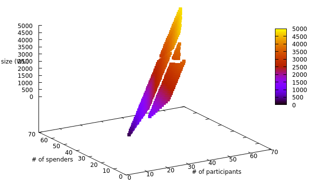

## A specific Script for the vault and unvault

```
$ cargo run --release -- getone 8 3
    Finished release [optimized] target(s) in 0.01s
     Running `target/release/revault_scripts getone 8 3`
vault output:
-------------
  Witness Program: Script(OP_PUSHNUM_8 OP_PUSHBYTES_33 033e986a0421a9290a92a2158e303d4eaa61cc748ccd036923eb2deced1b0f0640 OP_PUSHBYTES_33 03dae086f0d166f022fc95fb2d17b0731d2be366f123d1b442b0da70de4982cf5d OP_PUSHBYTES_33 02666368b6d1b279a52e4d57d5a443b6d840794fce4fb0982216615fabebbb967d OP_PUSHBYTES_33 020109e6343451d7c97d936ff9ed4715fcb15f18a1f28690acd40bd4302fce2e44 OP_PUSHBYTES_33 03a519265d5596db5d0af6fb2a73a0fd813e288d628bb5e0c7d66d8ead84f845a3 OP_PUSHBYTES_33 02045d6a2ecd1fe442c251515411162fffc082c029ea3feb1f0cb5328671acc37e OP_PUSHBYTES_33 023d61cc963160790950461d49f7b00fce0ee67431e5bc4dfb8a2322b752d21d69 OP_PUSHBYTES_33 036c684a907377eeab8da46f831684bb89c8f3a27b3d2e2b13e298a3fcf1ba9c5a OP_PUSHNUM_8 OP_CHECKMULTISIG)
  Program size: 275 WU
  Witness size: 585 WU

======================

unvault output:
---------------
  Witness Program: Script(OP_PUSHNUM_3 OP_PUSHBYTES_33 02045d6a2ecd1fe442c251515411162fffc082c029ea3feb1f0cb5328671acc37e OP_PUSHBYTES_33 023d61cc963160790950461d49f7b00fce0ee67431e5bc4dfb8a2322b752d21d69 OP_PUSHBYTES_33 036c684a907377eeab8da46f831684bb89c8f3a27b3d2e2b13e298a3fcf1ba9c5a OP_PUSHNUM_3 OP_CHECKMULTISIGVERIFY OP_PUSHNUM_5 OP_PUSHBYTES_33 03eab5aa6f71c96b1eedeb0f71b097b3ad374adf79d1c5439f4cebb92ff357147f OP_PUSHBYTES_33 033a168859ba5d69d63804b982c912433b3651d98f0777154ee42012672cb26f45 OP_PUSHBYTES_33 026629714d93789904f6b71d3780e1860462d9eab7501db36cc9bd929ceab7d998 OP_PUSHBYTES_33 025e9645dd016abffe42481b447c221b9c26478b4f386a6adeb025ec6d9402f0cc OP_PUSHBYTES_33 020dc2fc4de3527d1ffa752062ce8d40fcef0d89adddd6c54141406b88d5fee8ae OP_PUSHNUM_5 OP_CHECKMULTISIG OP_NOTIF OP_DUP OP_HASH160 OP_PUSHBYTES_20 e9fcd32e027516e0c9f5cf65f5ba26c39b20b9c7 OP_EQUALVERIFY OP_CHECKSIG OP_TOALTSTACK OP_DUP OP_HASH160 OP_PUSHBYTES_20 6334e4b99c00fadc6d96801bec94c0537cdbb841 OP_EQUALVERIFY OP_CHECKSIG OP_FROMALTSTACK OP_ADD OP_TOALTSTACK OP_DUP OP_HASH160 OP_PUSHBYTES_20 af43dcd9a2c98a21f7b93063a153b569ff1045e1 OP_EQUALVERIFY OP_CHECKSIG OP_FROMALTSTACK OP_ADD OP_TOALTSTACK OP_DUP OP_HASH160 OP_PUSHBYTES_20 be0273c485e19c95812a40883b03e47a86059128 OP_EQUALVERIFY OP_CHECKSIG OP_FROMALTSTACK OP_ADD OP_TOALTSTACK OP_DUP OP_HASH160 OP_PUSHBYTES_20 5aa004c0b580e96d2c1b7cbbcc625c9e3125ef89 OP_EQUALVERIFY OP_CHECKSIG OP_FROMALTSTACK OP_ADD OP_PUSHNUM_5 OP_EQUAL OP_ELSE OP_PUSHBYTES_1 64 OP_CSV OP_ENDIF)
  Program size: 423 WU
  Witness size: 1121 WU
```

## All possible scripts and their size
```
$ cargo run --release -- getall > all.csv
$ gnuplot
gnuplot> set datafile separator comma; set xlabel '# of participants'; set ylabel '# of spenders'; set zlabel 'size (WU)'; set pm3d at b;splot 'all.csv' using 1:2:3 with points palette pointsize 3 pointtype 5
```



(To avoid the (ineffictient) regeneration of the CSV a sample is already committed as
[`all.csv`](all.csv)).
